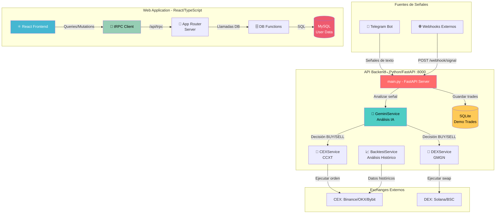
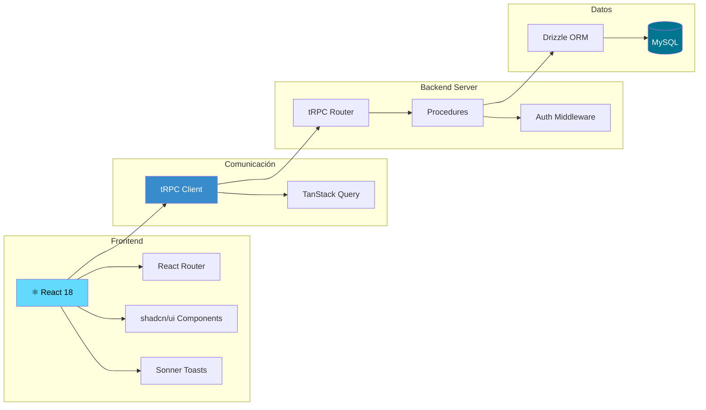
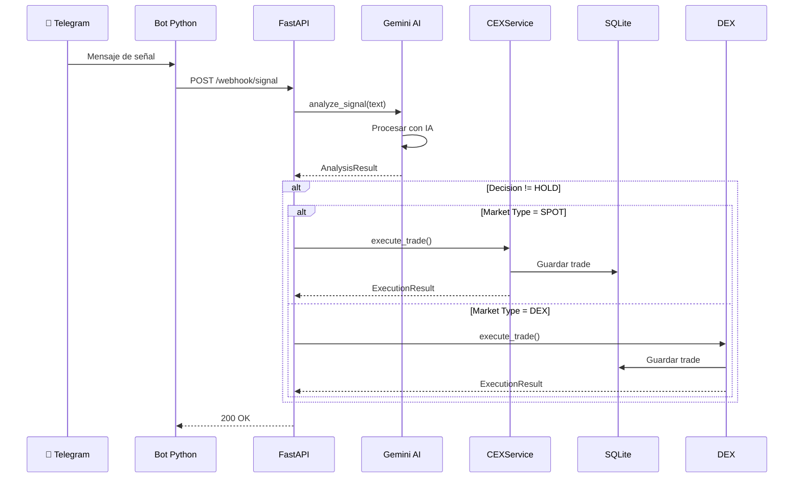
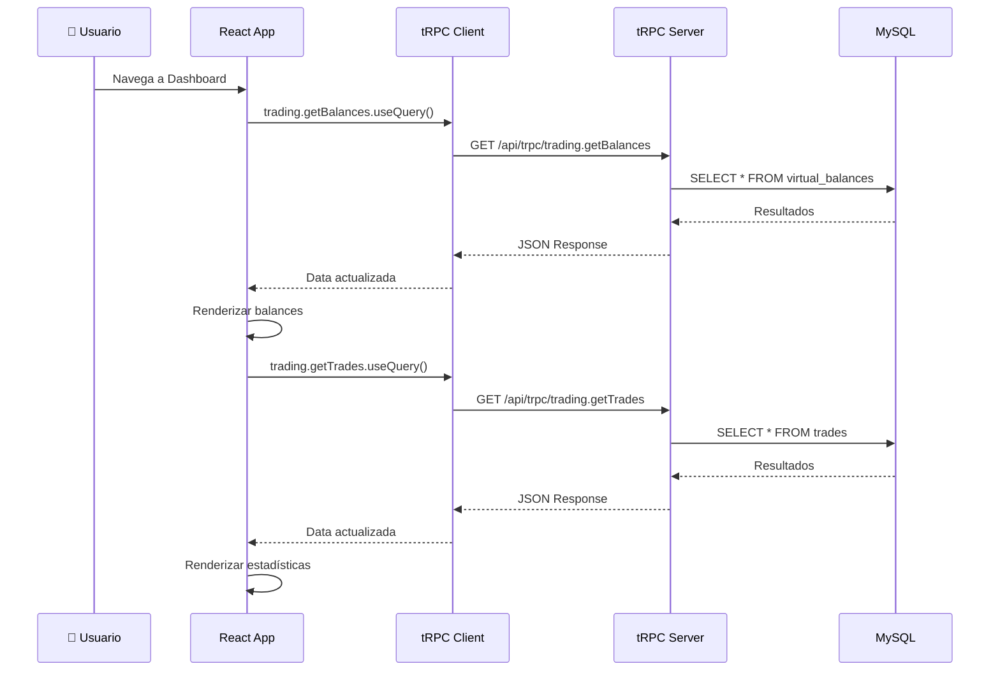
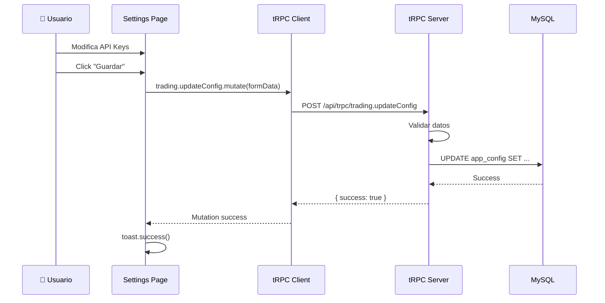
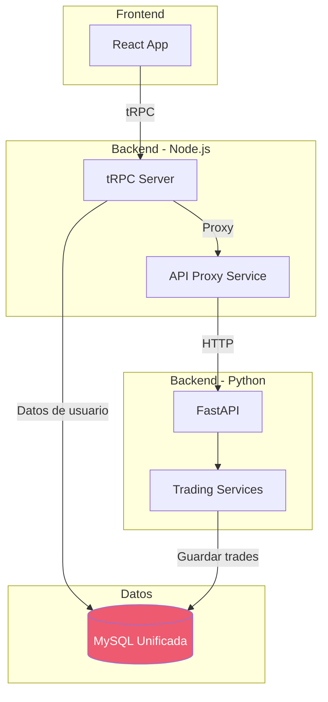
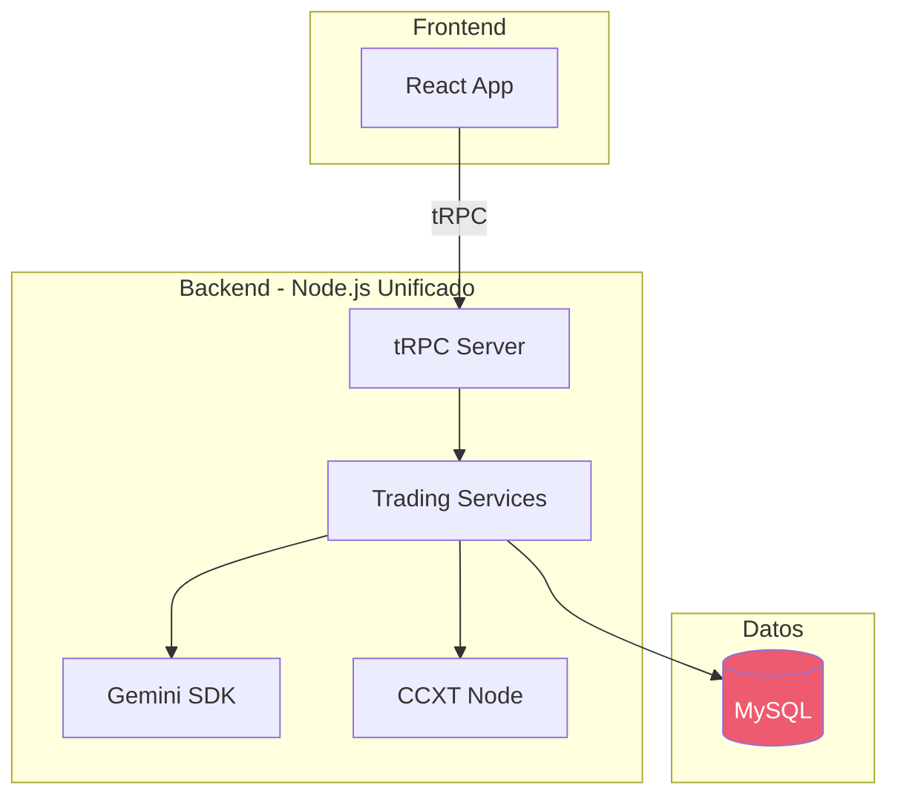
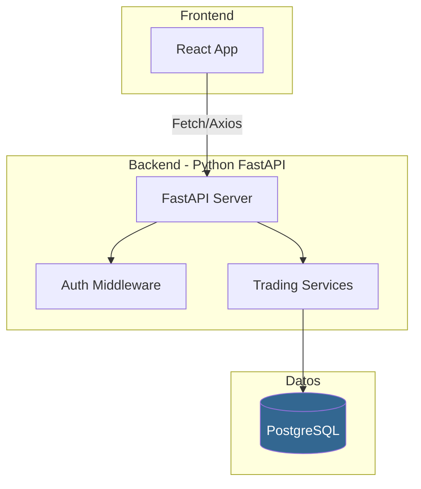

# 📊 Análisis de Integración: API y Web - SignalKey Platform

**Fecha**: 16 de Enero de 2026  
**Plataforma**: SignalKey Trading Bot  
**Autor**: Análisis Técnico Completo  

---

## 📋 Resumen Ejecutivo

La plataforma **SignalKey** es un sistema de trading automatizado de criptomonedas que consta de **dos arquitecturas separadas e independientes**:

1. **API Backend (Python/FastAPI)**: Sistema de procesamiento de señales de trading con IA
2. **Web Application (React/TypeScript/tRPC)**: Aplicación web independiente con su propia base de datos

> [!IMPORTANT]
> **Hallazgo Crítico**: Las dos aplicaciones actualmente **NO están integradas**. La API Python y la Web App operan de forma completamente independiente con bases de datos separadas (SQLite vs MySQL).

---

## 🏗️ Arquitectura General del Sistema



---

## 🔧 Análisis Detallado de la API Python (FastAPI)

### 📍 Ubicación
```
e:\antigravity\signaalKei_platform\api\
```

### 🎯 Propósito
API de procesamiento de señales de trading que recibe alertas de Telegram o webhooks, las analiza con IA (Gemini), y ejecuta operaciones en exchanges.

### 📁 Estructura de Servicios

#### 1️⃣ **GeminiService** (`services/gemini_service.py`)

**Responsabilidad**: Análisis de señales de trading usando Google Gemini AI

**Funcionalidades**:
- ✅ Análisis de texto de señales de trading
- ✅ Extracción de parámetros (símbolo, decisión, tipo de mercado)
- ✅ Generación de decisiones: BUY, SELL, HOLD
- ✅ Cálculo de nivel de confianza (0.0 - 1.0)

**Método Principal**:
```python
async def analyze_signal(self, text: str) -> AnalysisResult
```

**Entrada**: Texto plano de señal de trading  
**Salida**: 
```python
{
    "decision": "BUY" | "SELL" | "HOLD",
    "symbol": "BTC/USDT",
    "market_type": "SPOT" | "DEX",
    "confidence": 0.85,
    "reasoning": "Análisis detallado...",
    "parameters": {
        "amount": 0.001,
        "tp": 50000,
        "sl": 45000,
        "network": "solana"
    }
}
```

**Prompt Engineering**:
- Solicita respuesta en formato JSON estructurado
- Extrae símbolo, tipo de mercado, y parámetros de trading
- Incluye razonamiento de la decisión

---

#### 2️⃣ **CEXService** (`services/cex_service.py`)

**Responsabilidad**: Ejecución de trades en exchanges centralizados vía CCXT

**Funcionalidades**:
- ✅ Soporte multi-exchange (Binance, OKX, KuCoin, Bybit)
- ✅ Configuración dinámica de credenciales
- ✅ Modo Demo (Paper Trading) con balance virtual
- ✅ Registro de trades en SQLite
- ⚠️ Ejecución real comentada (simulado)

**Método Principal**:
```python
async def execute_trade(self, analysis: AnalysisResult) -> ExecutionResult
```

**Flujo de Ejecución**:
1. Valida credenciales del exchange
2. Extrae parámetros de la señal (símbolo, lado, cantidad)
3. **Modo Demo**: 
   - Obtiene precio actual del ticker
   - Registra trade en `TradeHistory`
   - Actualiza `VirtualBalance`
4. **Modo Real** (comentado): Ejecutaría `create_order()`

**Configuración de Exchanges**:
```python
config = {
    'apiKey': self.api_key,
    'secret': self.secret,
    'enableRateLimit': True,
    'password': self.password,  # OKX, KuCoin
    'uid': self.uid             # OKX
}
```

---

#### 3️⃣ **DEXService** (`services/dex_service.py`)

**Responsabilidad**: Ejecución de trades en exchanges descentralizados vía GMGN API

**Funcionalidades**:
- ✅ Integración con GMGN.ai para DEX
- ✅ Soporte para Solana, Ethereum, BSC
- ✅ Modo Demo con balance virtual de SOL
- ⚠️ Ejecución real no implementada (requiere firma de transacciones)

**Método Principal**:
```python
async def execute_trade(self, analysis: AnalysisResult) -> ExecutionResult
```

**Flujo de Ejecución**:
1. Valida API key de GMGN y private key de wallet
2. **Modo Demo**:
   - Registra trade en `TradeHistory`
   - Actualiza balance virtual de SOL
3. **Modo Real**: Placeholder para implementación futura

**Limitaciones Actuales**:
- No hay implementación de firma de transacciones
- No hay integración con wallets (Phantom, MetaMask)
- Precio no disponible en simulación DEX

---

#### 4️⃣ **BacktestService** (`services/backtest_service.py`)

**Responsabilidad**: Backtesting de estrategias con datos históricos

**Funcionalidades**:
- ✅ Obtención de datos OHLCV históricos vía CCXT
- ✅ Estrategia de ejemplo: Cruce de medias móviles (SMA 10/30)
- ✅ Cálculo de métricas de rendimiento
- ✅ Registro de trades simulados

**Método Principal**:
```python
async def run_backtest(self, symbol: str, days: int = 7, timeframe: str = '1h')
```

**Salida**:
```python
{
    "symbol": "BTC/USDT",
    "initial_balance": 10000.0,
    "final_balance": 10523.45,
    "profit_percentage": 5.23,
    "total_trades": 15,
    "trades": [...]  # Últimos 10 trades
}
```

**Estrategia Implementada**:
- **Señal de Compra**: SMA corta cruza por encima de SMA larga
- **Señal de Venta**: SMA corta cruza por debajo de SMA larga
- Balance inicial: $10,000 USD

---

### 🌐 Endpoints de la API FastAPI

#### Endpoints Principales

| Método | Endpoint | Descripción | Estado |
|--------|----------|-------------|--------|
| `POST` | `/webhook/signal` | Recibir señales de trading | ✅ Funcional |
| `GET` | `/health` | Health check | ✅ Funcional |
| `GET` | `/demo/balance` | Consultar balances virtuales | ✅ Funcional |
| `GET` | `/demo/history` | Historial de trades demo | ✅ Funcional |
| `GET` | `/backtest/{symbol}` | Ejecutar backtesting | ✅ Funcional |

#### Ejemplo de Uso - Webhook

```bash
POST http://localhost:8000/webhook/signal
Content-Type: application/json

{
  "source": "telegram",
  "raw_text": "🚀 BUY BTC/USDT at market, TP: 50000, SL: 45000, amount: 0.001",
  "metadata": {
    "channel": "crypto_signals",
    "timestamp": "2026-01-16T00:00:00Z"
  }
}
```

**Respuesta**:
```json
{
  "status": "Signal received and processing in background"
}
```

---

### 🗄️ Base de Datos - API (SQLite)

**Modelos**:

1. **VirtualBalance**: Balances virtuales para modo demo
   - `market_type`: CEX o DEX
   - `asset`: USDT, SOL, etc.
   - `amount`: Cantidad disponible

2. **TradeHistory**: Historial de trades ejecutados
   - `symbol`: Par de trading
   - `side`: BUY o SELL
   - `price`: Precio de ejecución
   - `amount`: Cantidad
   - `market_type`: CEX o DEX
   - `is_demo`: Boolean

---

## ⚛️ Análisis Detallado de la Web Application

### 📍 Ubicación
```
e:\antigravity\signaalKei_platform\web\
```

### 🎯 Propósito
Aplicación web moderna para gestión de configuración de trading, visualización de señales, trades, y backtesting.

### 🏛️ Arquitectura - Stack Tecnológico



**Stack Completo**:
- **Frontend**: React 18 + TypeScript + Vite
- **UI**: shadcn/ui (Radix UI + Tailwind CSS)
- **Comunicación**: tRPC + TanStack Query
- **Backend**: Node.js + Express
- **ORM**: Drizzle ORM
- **Base de Datos**: MySQL
- **Autenticación**: OAuth (Manus)

---

### 📡 Sistema tRPC - Routers y Procedures

#### Archivo: `web/server/routers.ts`

**Estructura de Routers**:

```typescript
export const appRouter = router({
  system: systemRouter,
  auth: authRouter,
  trading: tradingRouter
});
```

#### 1️⃣ **Auth Router**

```typescript
auth: router({
  me: publicProcedure.query(opts => opts.ctx.user),
  logout: publicProcedure.mutation(({ ctx }) => {
    ctx.res.clearCookie(COOKIE_NAME, { ...cookieOptions, maxAge: -1 });
    return { success: true };
  })
})
```

**Funcionalidades**:
- ✅ Obtener usuario actual
- ✅ Cerrar sesión

---

#### 2️⃣ **Trading Router** (Principal)

```typescript
trading: router({
  getConfig: protectedProcedure.query(async ({ ctx }) => {
    const { getAppConfig } = await import("./db");
    return await getAppConfig(ctx.user.id);
  }),
  
  updateConfig: protectedProcedure
    .input(z.record(z.string(), z.any()))
    .mutation(async ({ ctx, input }) => {
      const { upsertAppConfig } = await import("./db");
      await upsertAppConfig(ctx.user.id, input);
      return { success: true };
    }),
  
  getSignals: protectedProcedure.query(async ({ ctx }) => {
    const { getTradingSignals } = await import("./db");
    return await getTradingSignals(ctx.user.id);
  }),
  
  getTrades: protectedProcedure.query(async ({ ctx }) => {
    const { getTrades } = await import("./db");
    return await getTrades(ctx.user.id);
  }),
  
  getBalances: protectedProcedure.query(async ({ ctx }) => {
    const { getVirtualBalances } = await import("./db");
    return await getVirtualBalances(ctx.user.id);
  })
})
```

**Procedures Disponibles**:

| Procedure | Tipo | Descripción | Autenticación |
|-----------|------|-------------|---------------|
| `getConfig` | Query | Obtener configuración del usuario | 🔒 Protegido |
| `updateConfig` | Mutation | Actualizar configuración | 🔒 Protegido |
| `getSignals` | Query | Obtener señales de trading | 🔒 Protegido |
| `getTrades` | Query | Obtener historial de trades | 🔒 Protegido |
| `getBalances` | Query | Obtener balances virtuales | 🔒 Protegido |

---

### 🗄️ Base de Datos - Web (MySQL)

#### Archivo: `web/drizzle/schema.ts`

**Esquema de Tablas**:

#### 1. **users**
```typescript
{
  id: int (PK, auto-increment),
  openId: varchar(64) (unique),
  name: text,
  email: varchar(320),
  loginMethod: varchar(64),
  role: enum('user', 'admin'),
  createdAt: timestamp,
  updatedAt: timestamp,
  lastSignedIn: timestamp
}
```

#### 2. **app_config**
```typescript
{
  id: int (PK),
  userId: int (FK -> users.id),
  demoMode: int (default: 1),
  geminiApiKey: text,
  gmgnApiKey: text,
  telegramBotToken: text,
  exchangeId: varchar(64) (default: 'binance'),
  cexApiKey: text,
  cexSecret: text,
  cexPassword: text,
  cexUid: text,
  dexWalletPrivateKey: text,
  createdAt: timestamp,
  updatedAt: timestamp
}
```

#### 3. **trading_signals**
```typescript
{
  id: int (PK),
  userId: int (FK -> users.id),
  source: varchar(64),
  rawText: text,
  decision: varchar(20),
  symbol: varchar(128),
  marketType: varchar(20),
  confidence: float,
  reasoning: text,
  status: varchar(20) (default: 'pending'),
  createdAt: timestamp
}
```

#### 4. **trades**
```typescript
{
  id: int (PK),
  userId: int (FK -> users.id),
  signalId: int (FK -> trading_signals.id),
  symbol: varchar(128),
  side: varchar(10),
  price: float,
  amount: float,
  marketType: varchar(20),
  isDemo: int (default: 1),
  orderId: varchar(256),
  status: varchar(20),
  pnl: float,
  createdAt: timestamp,
  executedAt: timestamp
}
```

#### 5. **virtual_balances**
```typescript
{
  id: int (PK),
  userId: int (FK -> users.id),
  marketType: varchar(20),
  asset: varchar(64),
  amount: float,
  updatedAt: timestamp
}
```

---

### 📱 Páginas de la Aplicación Web

#### 1️⃣ **Dashboard** (`pages/Dashboard.tsx`)

**Consumo de API**:
```typescript
const { data: balances } = trpc.trading.getBalances.useQuery();
const { data: trades } = trpc.trading.getTrades.useQuery();
```

**Funcionalidades**:
- ✅ Visualización de balances CEX y DEX
- ✅ Estadísticas de trading (Total trades, Win rate, P&L)
- ✅ Trades recientes (últimos 5)
- ✅ Indicador de modo demo

**Métricas Calculadas**:
- Total de trades
- Win rate (%)
- P&L total ($)
- P&L promedio ($)

---

#### 2️⃣ **Signals** (`pages/Signals.tsx`)

**Consumo de API**:
```typescript
const { data: signals } = trpc.trading.getSignals.useQuery();
```

**Funcionalidades**:
- ✅ Feed de señales en tiempo real
- ✅ Visualización de decisión (BUY/SELL/HOLD)
- ✅ Nivel de confianza con barra de progreso
- ✅ Razonamiento de Gemini AI
- ✅ Texto original de la señal
- ✅ Estado de ejecución (executed/pending/failed)

**Información Mostrada**:
- Símbolo
- Decisión con color coding
- Tipo de mercado (SPOT/DEX)
- Fuente (telegram/webhook)
- Confianza (0-100%)
- Análisis de IA
- Timestamp

---

#### 3️⃣ **Trades** (`pages/Trades.tsx`)

**Consumo de API**:
```typescript
const { data: trades } = trpc.trading.getTrades.useQuery();
```

**Funcionalidades**:
- ✅ Tabla completa de historial de trades
- ✅ Filtros avanzados:
  - Por símbolo (búsqueda)
  - Por mercado (CEX/DEX)
  - Por tipo (BUY/SELL)
  - Por modo (Demo/Real)
- ✅ Estadísticas agregadas
- ✅ Visualización de P&L con colores

**Columnas de la Tabla**:
- Símbolo
- Tipo (BUY/SELL con iconos)
- Mercado
- Precio
- Cantidad
- P&L
- Modo (Demo/Real)
- Estado
- Fecha

---

#### 4️⃣ **Settings** (`pages/Settings.tsx`)

**Consumo de API**:
```typescript
const { data: config } = trpc.trading.getConfig.useQuery();
const updateConfigMutation = trpc.trading.updateConfig.useMutation();
```

**Funcionalidades**:
- ✅ Configuración de API Keys:
  - Gemini AI
  - GMGN (DEX)
  - Telegram Bot
- ✅ Configuración de Exchange CEX:
  - Selección de exchange (Binance/OKX/KuCoin/Bybit)
  - API Key
  - API Secret
  - Passphrase (opcional)
  - UID (opcional)
- ✅ Configuración de Wallet DEX:
  - Private Key
- ✅ Toggle para mostrar/ocultar secretos
- ✅ Guardado persistente en MySQL

---

#### 5️⃣ **Backtest** (`pages/Backtest.tsx`)

**Estado Actual**: ⚠️ **NO INTEGRADO CON LA API**

**Funcionalidades**:
- ❌ Simulación local (mock data)
- ❌ No consume endpoint `/backtest/{symbol}` de la API Python
- ✅ UI completa con configuración
- ✅ Visualización de resultados simulados

**Configuración Disponible**:
- Símbolo
- Timeframe (1m, 5m, 15m, 1h, 4h, 1d)
- Días históricos

**Métricas Mostradas** (simuladas):
- Total de trades
- Win rate
- Profit factor
- Max drawdown
- Retorno total
- Sharpe ratio

---

## 🔄 Flujo de Datos Completo

### Escenario 1: Recepción y Procesamiento de Señal



### Escenario 2: Usuario Consulta Dashboard



### Escenario 3: Usuario Actualiza Configuración



---

## ⚠️ Problemas y Limitaciones Identificadas

### 🔴 Crítico

1. **Desconexión Total entre API y Web**
   - La API Python (FastAPI) y la Web App (React/tRPC) son **sistemas completamente separados**
   - No hay comunicación entre ellos
   - Usan bases de datos diferentes (SQLite vs MySQL)
   - Los datos de la API Python **NO son accesibles** desde la Web App

2. **Duplicación de Esquemas**
   - `VirtualBalance` existe en ambas bases de datos
   - `TradeHistory` (SQLite) vs `trades` (MySQL)
   - Sin sincronización entre ellas

3. **Página de Backtest No Funcional**
   - No consume el endpoint `/backtest/{symbol}` de la API
   - Solo muestra datos simulados localmente
   - Desperdicia la funcionalidad implementada en `BacktestService`

### 🟡 Advertencias

4. **Ejecución Real Deshabilitada**
   - Tanto CEX como DEX tienen la ejecución real comentada
   - Solo funciona en modo demo
   - Requiere implementación de firma de transacciones para DEX

5. **Sin Validación de Credenciales**
   - La Web App guarda credenciales en MySQL
   - La API Python lee credenciales de `.env`
   - No hay validación de que las credenciales sean correctas

6. **Falta de Manejo de Errores**
   - No hay reintentos en caso de fallo de API
   - No hay manejo de rate limits de exchanges
   - No hay validación de saldo suficiente antes de ejecutar

### 🟢 Mejoras Recomendadas

7. **Sin Notificaciones en Tiempo Real**
   - No hay WebSockets para actualizar la UI
   - El usuario debe refrescar manualmente
   - Las señales nuevas no aparecen automáticamente

8. **Falta de Tests**
   - No hay tests unitarios para servicios
   - No hay tests de integración
   - No hay validación de contratos de API

---

## 💡 Recomendaciones de Integración

### Opción 1: Integrar API Python en la Web App

**Arquitectura Propuesta**:



**Pasos**:
1. Crear servicio proxy en Node.js para comunicarse con FastAPI
2. Migrar SQLite a MySQL
3. Actualizar API Python para usar MySQL
4. Crear endpoints tRPC que llamen a FastAPI
5. Integrar página de Backtest con endpoint real

**Ventajas**:
- ✅ Mantiene la lógica de trading en Python
- ✅ Aprovecha el ecosistema de IA de Python
- ✅ Base de datos unificada
- ✅ UI moderna con React

**Desventajas**:
- ⚠️ Requiere mantener dos servidores
- ⚠️ Mayor complejidad de deployment
- ⚠️ Latencia adicional por proxy

---

### Opción 2: Migrar Servicios de Python a Node.js

**Arquitectura Propuesta**:



**Pasos**:
1. Reescribir servicios en TypeScript
2. Usar `@google/generative-ai` para Gemini
3. Usar `ccxt` (disponible en Node.js)
4. Integrar todo en tRPC
5. Eliminar API Python

**Ventajas**:
- ✅ Stack unificado (TypeScript)
- ✅ Un solo servidor
- ✅ Type safety end-to-end
- ✅ Deployment simplificado

**Desventajas**:
- ⚠️ Requiere reescribir código
- ⚠️ Perder optimizaciones de Python para ML
- ⚠️ Tiempo de desarrollo significativo

---

### Opción 3: Usar la Web App como Frontend de la API Python

**Arquitectura Propuesta**:



**Pasos**:
1. Eliminar tRPC y Node.js backend
2. Expandir FastAPI con endpoints de usuario
3. Implementar autenticación en FastAPI
4. Migrar a PostgreSQL
5. Usar fetch/axios en React

**Ventajas**:
- ✅ Arquitectura más simple
- ✅ Un solo backend
- ✅ Aprovecha Python para IA

**Desventajas**:
- ⚠️ Pierde type safety de tRPC
- ⚠️ Requiere implementar auth en Python
- ⚠️ Menos ecosistema para frontend en Python

---

## 📊 Comparativa de Opciones

| Criterio | Opción 1: Proxy | Opción 2: Node.js | Opción 3: Python |
|----------|----------------|-------------------|------------------|
| **Complejidad** | 🟡 Media | 🔴 Alta | 🟢 Baja |
| **Type Safety** | 🟢 Completo | 🟢 Completo | 🔴 Parcial |
| **Performance** | 🟡 Buena | 🟢 Excelente | 🟢 Excelente |
| **Tiempo Desarrollo** | 🟢 2-3 semanas | 🔴 6-8 semanas | 🟡 3-4 semanas |
| **Mantenibilidad** | 🟡 Media | 🟢 Alta | 🟡 Media |
| **Ecosistema IA** | 🟢 Python | 🟡 Node.js | 🟢 Python |
| **Deployment** | 🔴 2 servidores | 🟢 1 servidor | 🟢 1 servidor |

---

## 🎯 Recomendación Final

> [!IMPORTANT]
> **Recomendación**: Implementar **Opción 1 (API Proxy)** como solución a corto plazo, con migración gradual a **Opción 2 (Node.js)** a largo plazo.

### Plan de Implementación Sugerido

#### Fase 1: Integración Inmediata (2-3 semanas)

1. **Crear servicio proxy en Node.js**
   ```typescript
   // web/server/services/pythonApiProxy.ts
   export async function callPythonApi(endpoint: string, data: any) {
     const response = await fetch(`http://localhost:8000${endpoint}`, {
       method: 'POST',
       headers: { 'Content-Type': 'application/json' },
       body: JSON.stringify(data)
     });
     return response.json();
   }
   ```

2. **Migrar SQLite a MySQL**
   - Crear script de migración
   - Actualizar modelos de Python para usar MySQL
   - Sincronizar esquemas

3. **Integrar Backtest**
   ```typescript
   // Nuevo procedure en trading router
   runBacktest: protectedProcedure
     .input(z.object({
       symbol: z.string(),
       days: z.number(),
       timeframe: z.string()
     }))
     .mutation(async ({ input }) => {
       return await callPythonApi('/backtest/' + input.symbol, input);
     })
   ```

4. **Implementar WebSocket para señales en tiempo real**

#### Fase 2: Optimización (4-6 semanas)

5. **Reescribir servicios críticos en TypeScript**
   - GeminiService
   - CEXService (usando ccxt)
   
6. **Implementar tests**
   - Unit tests para servicios
   - Integration tests para API
   - E2E tests para flujos críticos

7. **Mejorar manejo de errores**
   - Reintentos automáticos
   - Circuit breakers
   - Logging centralizado

#### Fase 3: Producción (2-3 semanas)

8. **Implementar ejecución real**
   - Validación de credenciales
   - Firma de transacciones DEX
   - Límites de riesgo

9. **Deployment**
   - Docker containers
   - CI/CD pipeline
   - Monitoring y alertas

---

## 📈 Métricas de Éxito

### KPIs Técnicos
- ✅ Latencia API < 200ms
- ✅ Uptime > 99.9%
- ✅ Cobertura de tests > 80%
- ✅ Zero data loss en trades

### KPIs de Negocio
- ✅ Tiempo de procesamiento de señal < 5s
- ✅ Tasa de éxito de ejecución > 95%
- ✅ Usuarios activos diarios
- ✅ Volumen de trading procesado

---

## 📚 Documentación Adicional Recomendada

### Para Desarrolladores

1. **API Reference**
   - Documentar todos los endpoints con OpenAPI/Swagger
   - Ejemplos de uso con curl
   - Códigos de error y manejo

2. **Architecture Decision Records (ADR)**
   - Documentar decisiones técnicas importantes
   - Justificación de elección de tecnologías
   - Trade-offs considerados

3. **Deployment Guide**
   - Instrucciones de instalación
   - Configuración de entornos
   - Troubleshooting común

### Para Usuarios

4. **User Guide**
   - Cómo configurar API keys
   - Cómo interpretar señales
   - Mejores prácticas de trading

5. **FAQ**
   - Preguntas frecuentes
   - Problemas comunes
   - Soporte

---

## 🔐 Consideraciones de Seguridad

### Críticas

1. **Almacenamiento de Credenciales**
   - ⚠️ Private keys en texto plano en DB
   - **Recomendación**: Usar encriptación (AES-256)
   - **Recomendación**: Considerar HSM o AWS KMS

2. **Autenticación de API**
   - ⚠️ No hay autenticación en endpoints de FastAPI
   - **Recomendación**: Implementar API keys o JWT
   - **Recomendación**: Rate limiting

3. **Validación de Entrada**
   - ⚠️ Validación mínima en webhooks
   - **Recomendación**: Usar Pydantic para validación estricta
   - **Recomendación**: Sanitización de inputs

### Recomendadas

4. **HTTPS**
   - Usar certificados SSL en producción
   - Forzar HTTPS en todos los endpoints

5. **Secrets Management**
   - Usar variables de entorno
   - Nunca commitear `.env`
   - Rotar credenciales regularmente

6. **Audit Logging**
   - Registrar todas las operaciones de trading
   - Logs de acceso a credenciales
   - Alertas de actividad sospechosa

---

## 🎓 Conclusiones

### Fortalezas del Sistema Actual

✅ **Arquitectura Modular**: Separación clara de responsabilidades  
✅ **UI Moderna**: Interfaz de usuario profesional con shadcn/ui  
✅ **Type Safety**: tRPC proporciona type safety end-to-end en la web  
✅ **IA Integrada**: Uso efectivo de Gemini para análisis de señales  
✅ **Multi-Exchange**: Soporte para múltiples CEX y DEX  

### Debilidades Principales

❌ **Desconexión API-Web**: No hay integración entre los dos sistemas  
❌ **Duplicación de Datos**: Dos bases de datos sin sincronización  
❌ **Backtest No Funcional**: Página implementada pero sin backend  
❌ **Sin Ejecución Real**: Solo modo demo funcional  
❌ **Falta de Tests**: No hay cobertura de pruebas  

### Próximos Pasos Inmediatos

1. **Prioridad Alta**: Integrar API Python con Web App (Opción 1)
2. **Prioridad Alta**: Migrar a base de datos unificada (MySQL)
3. **Prioridad Media**: Implementar WebSockets para tiempo real
4. **Prioridad Media**: Conectar página de Backtest con API
5. **Prioridad Baja**: Implementar ejecución real de trades

---

## 📞 Contacto y Soporte

**Documentación**: Este análisis  
**Repositorio**: `e:\antigravity\signaalKei_platform\`  
**Fecha de Análisis**: 16 de Enero de 2026  

---

> [!NOTE]
> Este análisis está basado en el estado actual del código. Las recomendaciones son sugerencias y deben ser evaluadas según los requisitos específicos del negocio y recursos disponibles.
